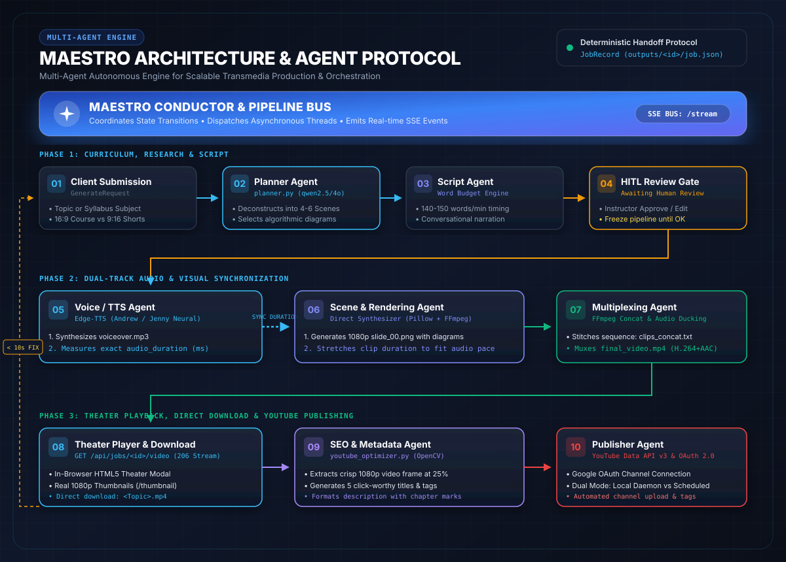

# 🎼 MAESTRO

<div align="center">

**Multi-Agent Autonomous Engine for Scalable Transmedia Production & Orchestration**

*One Conductor coordinating specialized agents across curriculum planning, neural speech, dynamic vector scenes, multiplexing, viral SEO, and YouTube distribution.*

[](https://www.python.org/)
[](https://fastapi.tiangolo.com/)
[](https://react.dev/)
[](https://ollama.com/)
[](MAESTRO.txt)
[](https://opensource.org/licenses/MIT)

</div>

---

## 🏛️ Multi-Agent Architecture & Orchestration

MAESTRO replaces chaotic free-form LLM chat loops with a **deterministic Shared Blackboard Architecture** driven by strict Pydantic type schemas and an asynchronous state machine:

<div align="center">
  
</div>

> [!TIP]
> 📖 **Looking for the deep-dive manual?** Read [MAESTRO.txt](MAESTRO.txt) — our 500-line comprehensive architectural book covering agent protocols, timing benchmarks, and complete command references.

---

## 🤖 How Agents Communicate in MAESTRO

In MAESTRO, agents do not pass unvalidated markdown or depend on heavy wrappers like LangChain. Instead, they operate through a high-performance **Shared Blackboard Protocol**:

```
                       [ M A E S T R O   C O N D U C T O R ]
                                (Pipeline Router)
                                        │
           ┌────────────────────────────┼────────────────────────────┐
           ▼                            ▼                            ▼
   1. PLANNER AGENT             2. SCRIPT AGENT              3. HITL REVIEW GATE
   • Syllabus / Topic           • Word Budget Calculation    • Human Approval
   • Scene Hierarchy (1 to 4)   • Conversational Narration   • Freeze until approved
           │                            │                            │
           └────────────────────────────┼────────────────────────────┘
                                        │ (Passes JobRecord State)
           ┌────────────────────────────┼────────────────────────────┐
           ▼                            ▼                            ▼
   4. VOICE / TTS AGENT         5. SCENE / VISUAL AGENT      6. MULTIPLEXING AGENT
   • Edge-TTS Neural Audio      • Pillow Vector Graphics     • FFmpeg Stitching
   • Exact Duration in ms       • Algorithmic Data Structures• BGM Ducking (5%)
           │                            │                            │
           └────────────────────────────┼────────────────────────────┘
                                        │ (Final MP4 Container)
                                        ▼
                           7. SEO & PUBLISHER AGENT
                           • OpenCV 1080p Thumbnail Frame
                           • 5 Click-Worthy Titles & Tags
                           • YouTube Data API v3 Upload
```

### 1. The Shared Blackboard Contract (`JobRecord`)
Every agent is a deterministic pure function. **Agent A** writes structured state into `JobRecord` on disk (`outputs/<job_id>/job.json`). **Agent B** reads that exact typed JSON payload as its input contract. No intermediate context is lost between phases.

### 2. Dual-Track Audio-Visual Timeline Synchronization
To prevent slides from cutting off or drifting out of sync:
1. The **Voice / TTS Agent** synthesizes `voiceover.mp3` first and measures the exact audio length down to the millisecond (`audio_duration`).
2. The **Scene & Visual Agent** dynamically scales slide display durations and vector animations to match `audio_duration` precisely.

### 3. Real-Time Browser Bus via SSE
Whenever an agent completes a task, the Conductor broadcasts a Server-Sent Event (SSE) across `GET /api/jobs/{job_id}/stream`. The React frontend receives this payload and updates progress bars, stage titles, and live terminal logs with zero polling.

### 4. Granular Scene Regeneration (`< 10s FIX`)
Need to fix a typo or modify a single diagram? MAESTRO does not force you to re-render the entire video. The Conductor re-renders **only that specific scene** and re-multiplexes the final video in under 10 seconds.

---

## ⚡ 100% Local Setup via Ollama (Free, Zero API Keys)

MAESTRO is built from the ground up to run **completely free on your local hardware** using [Ollama](https://ollama.com/).

### 1. Install Ollama
- **Windows**: Download the installer from [ollama.com/download](https://ollama.com/download)
- **Ubuntu / Linux**: `curl -fsSL https://ollama.com/install.sh | sh`
- **macOS**: Download from [ollama.com/download](https://ollama.com/download)

### 2. Pull Recommended Models

```bash
# Primary Planner & Script Engine (High Quality 7B parameters)
ollama pull qwen2.5:7b

# Fast Utility Model (Keywords, Classification, SEO)
ollama pull gemma3:4b
```

#### Hardware Allocation Matrix:
| Hardware Tier | Planner Model | Utility Model | Description |
| :--- | :--- | :--- | :--- |
| **8 GB RAM (CPU / Integrated)** | `qwen2.5:3b` | `gemma3:4b` | Lightweight & fast |
| **16 GB RAM / 6GB VRAM (Standard)** | `qwen2.5:7b` | `gemma3:4b` | **Recommended Default** |
| **32 GB RAM / 12GB+ VRAM (Power)** | `qwen3:14b` or `deepseek-r1:8b` | `gemma3:4b` | Maximum reasoning & math precision |

### 3. Start Ollama Server
```bash
ollama serve
```
*(Listens locally on `http://127.0.0.1:11434`)*

### 4. Configure `01_main_app/config.json`
Set `default_llm` to `"ollama"`:
```json
{
  "providers": {
    "default_llm": "ollama",
    "planner_model": "qwen2.5:7b",
    "coding_model": "qwen2.5:7b",
    "utility_model": "gemma3:4b",
    "ollama_url": "http://127.0.0.1:11434"
  }
}
```

---

## ☁️ Optional Cloud Hybrid Mode (OpenAI `gpt-4o-mini`)

For ultra-fast cloud generation (~2–4 seconds) without a local GPU:
1. Open `01_main_app/config.json`.
2. Add your key and set `default_llm` to `"openai"`:
   ```json
   {
     "providers": {
       "default_llm": "openai",
       "openai_api_key": "sk-proj-YOUR_API_KEY",
       "openai_model": "gpt-4o-mini"
     }
   }
   ```
* `gpt-4o-mini` costs **~₹0.15 (15 Paise)** per generated video.
* Built-in `CacheManager` stores prompts on disk for 7 days so identical requests cost **₹0**.
* Video rendering and neural voiceover always remain **100% local and free**.

---

## 🚀 Quickstart Guide

### Prerequisites
1. **Python 3.10+** (Added to system PATH)
2. **Node.js 18+ & npm** (For compiling React 19 UI)
3. **FFmpeg** (Installed and in system PATH)

### Installation (Windows)

```cmd
# 1. Clone the repository
git clone https://github.com/cheerlashamith/MAESTRO.git
cd MAESTRO\01_main_app

# 2. Copy the configuration template
copy config.example.json config.json

# 3. Run the automated installer
install.bat

# 4. Build the modern React frontend
cd frontend_v2
npm install
npm run build
cd ..

# 5. Start the MAESTRO Conductor
run.bat
```

Open your browser: 👉 **`http://127.0.0.1:8765`**

### Installation (Ubuntu / Linux)

```bash
# 1. Install system dependencies
sudo apt update && sudo apt install -y python3 python3-pip ffmpeg nodejs npm

# 2. Clone repository & install backend requirements
git clone https://github.com/cheerlashamith/MAESTRO.git
cd MAESTRO/01_main_app
pip install -r backend/requirements.txt

# 3. Build frontend
cd frontend_v2
npm install
npm run build
cd ..

# 4. Copy configuration & launch
cp config.example.json config.json
python3 -m uvicorn backend.main:app --host 0.0.0.0 --port 8765
```

---

## 🎬 Video Production Modes

| Mode | Visual Engine | Voiceover Engine | Description |
| :--- | :--- | :--- | :--- |
| **Manual Course Mode** | Direct Vector / Manim | Edge-TTS (Andrew Neural) | Syllabus-aware course lessons with animated code, trees, diagrams, and bullet points. Supports single topic or batch syllabus generation. |
| **Story Mode** | ComfyUI Image Diffusion | Edge-TTS (Jenny Neural) | Narrative storytelling with AI image diffusion and cinematic transitions. |
| **YouTube Extraction** | Pexels Stock / Direct Slides | Edge-TTS (Andrew Neural) | Converts any YouTube video URL into a brand-new structured summary course video. |
| **Autonomous Mode** | Auto-Selected Vector Engine | Edge-TTS (Andrew Neural) | Autonomous AI agent analyzes YouTube trends, formulates high-engagement topics, and produces videos end-to-end. |

---

## 📺 YouTube Publishing & Scheduling Suite

MAESTRO includes a production-ready **YouTube Publishing Studio**:

- **Google OAuth 2.0 Integration**: Secure 1-click channel connection with live subscriber counts and metrics.
- **AI Viral Metadata Optimizer**: Generates 5 click-worthy viral titles, timestamped chapter descriptions with hashtags/CTAs, and 15–20 high-ranking search tags.
- **Automatic 1080p Thumbnail Extraction**: OpenCV extracts a crisp video frame at ~25% timestamp as default thumbnail, with custom image upload support.
- **Resumable Chunked Uploading**: Uploads large video files in 2MB chunks with real-time percentage progress (0–100%).
- **Dual Scheduling Modes**:
  - **Local Daemon Queue**: Background thread automatically publishes at your target date/time.
  - **Native YouTube Scheduled**: Uploads immediately with `privacyStatus: private` and `publishAt` ISO timestamp.
- **In-Browser Theater Player**: Stream generated videos inside the web app using HTTP 206 partial chunking without external players.
- **Direct Clean Downloads**: Single-click downloads with real topic filenames (`<Topic_Name>.mp4`).

---

## 📁 Repository Structure

```
MAESTRO/
├── MAESTRO_ARCHITECTURE.svg          # Master Vector Multi-Agent Architecture Diagram
├── MAESTRO.txt                       # Official 500-Line Architecture Manual & Operations Book
├── 01_main_app/
│   ├── backend/
│   │   ├── core/
│   │   │   ├── config.py             # Configuration loader
│   │   │   ├── job_store.py          # Persistent disk & memory job store
│   │   │   └── schemas.py            # Pydantic data schemas & request models
│   │   ├── services/
│   │   │   ├── brain_manager.py      # LLM fallback router & disk cache
│   │   │   ├── pipeline.py           # End-to-end video pipeline controller
│   │   │   ├── planner.py            # Syllabus planning & scene breakdown
│   │   │   ├── renderer.py           # Manim, ComfyUI, Pillow, and Pexels renderers
│   │   │   ├── mpt_bridge.py         # Direct synthesizer & Edge-TTS bridge
│   │   │   ├── youtube_auth.py       # Google OAuth 2.0 service
│   │   │   ├── youtube_optimizer.py  # AI SEO, titles & OpenCV thumbnail extractor
│   │   │   ├── youtube_scheduler.py  # Background publishing queue daemon
│   │   │   └── youtube_upload.py     # YouTube Data API v3 uploader & analytics
│   │   ├── main.py                   # FastAPI REST API, SSE streaming, & download routes
│   │   └── requirements.txt          # Python dependencies
│   ├── frontend_v2/                  # React 19 + TypeScript + Vite UI
│   │   ├── src/
│   │   │   ├── pages/user/           # CreateVideo, YouTubePublisher, MyVideos
│   │   │   ├── pages/admin/          # BrainManager, Analytics, SystemDashboard
│   │   │   └── components/           # Sidebar, Navbar, TheaterModal, AppLayout
│   │   └── dist/                     # Production compiled frontend bundle
│   ├── config.json                   # Local configuration (API keys, paths)
│   ├── config.example.json           # Template configuration
│   ├── install.bat                   # 1-click Windows installer
│   └── run.bat                       # 1-click Windows launcher
├── 02_engines/                       # Standalone engine references & tools
├── 03_docs/                          # Architectural documentation
└── README.md                         # Master Documentation
```

---

## 🔒 Security Best Practices

- Never commit `config.json`, `client_secret.json`, or `token.json` to public repositories. These files are excluded by default in [`.gitignore`](.gitignore).
- Use `config.example.json` as a clean template for distribution.

---

## 📄 License

This project is licensed under the [MIT License](LICENSE).
